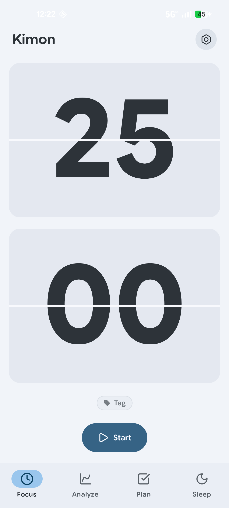
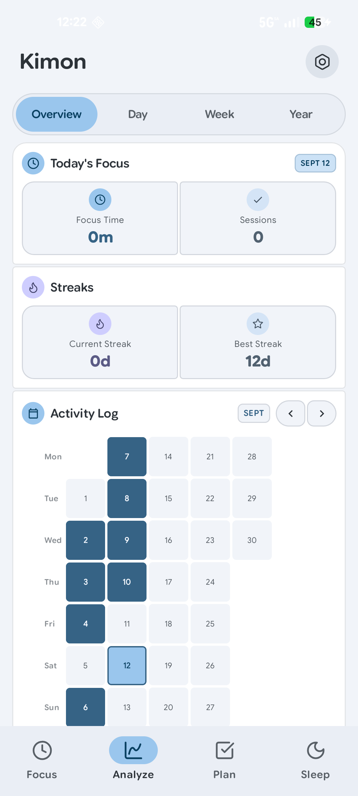
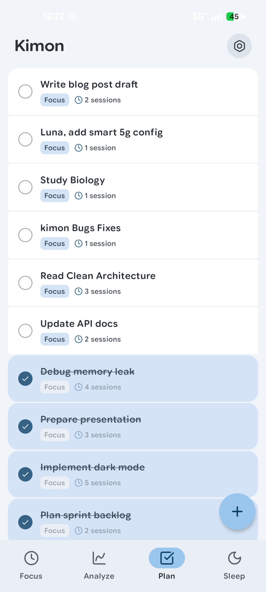
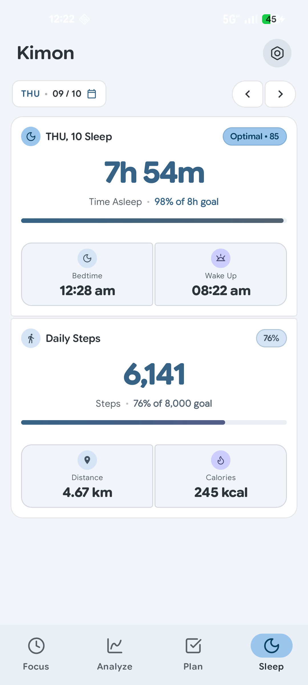

# Cylo — Focus, Planning & Sleep Companion

> **Built by Leo Aristocrat**  
> An expressive, modern Android companion for deep focus, task planning, activity tracking, and comprehensive sleep monitoring.

Cylo is built with **Kotlin**, **Jetpack Compose**, and **Material 3 Expressive**, leveraging modern Android architecture components, hardware sensors, and system health APIs.

---

## Features

### Focus
* **Pomodoro Timer**: Highly customizable focus sessions with concentric-dial and flip-clock timer interfaces.
* **Tagging System**: Organize focus sessions by custom colored tags with target daily allocations.
* **Flow Enhancements**: Automatic break/focus transitions, keep-screen-on mode, and Do-Not-Disturb (DND) integration.
* **Persistent Notification**: Low-overhead foreground service countdown with quick actions.

### Analyze
* **Comprehensive Stats**: Track daily, weekly, yearly, and all-time focus statistics.
* **Visual Breakdown**: Dynamic tag distribution donut charts, focus trends, and hourly breakdown charts.
* **Streaks & Heatmap**: Daily focus streaks and a continuous GitHub-style calendar activity heatmap.

### Plan
* **Task Management**: Lightweight task list with estimated focus sessions.
* **Seamless Workflow**: Quick swipe-to-delete, tag association, and completion status.

### Sleep
* **Automatic Detection**: Low-power sleep detection via Google Play Services Sleep API.
* **Health Connect Integration**: Two-way synchronization with Android Health Connect.
* **Manual Logs & Sleep Score**: Sleep duration, quality scoring, consistency tracking, and weekly breakdown.

### Steps & Activity
* **Hardware Step Counter**: Built-in pedometer sensor support with background step accumulation.
* **Daily Goals**: Configurable daily step goals with continuous progress metrics.

### Home-Screen Widgets
* **Last Night's Sleep Widget**: Glanceable sleep duration, quality rating, and bedtime/wake times.
* **Focus Heatmap Widget**: Dynamic calendar heatmap with streak and daily focus summary directly on your launcher.

### Data & Customization
* **JSON Backup & Restore**: Full local export and import into a single JSON file (compatible with both Cylo and legacy backups).
* **Expressive Appearance**: Dynamic system colors (Material You), AMOLED pitch-black mode, and curated palettes.

---

## Screenshots

<table>
  <tr>
    <td align="center">
      <br/>
      <sub><b>Focus Timer</b></sub>
    </td>
    <td align="center">
      <br/>
      <sub><b>Analyze — Overview</b></sub>
    </td>
    <td align="center">
      <br/>
      <sub><b>Plan</b></sub>
    </td>
    <td align="center">
      <br/>
      <sub><b>Sleep & Steps</b></sub>
    </td>
  </tr>
</table>

[View all screenshots](SCREENSHOTS.md)

---

## Tech Stack & Architecture

* **UI & Design**: [Jetpack Compose](https://developer.android.com/jetpack/compose), Material 3 Expressive, Edge-to-Edge display
* **Navigation**: AndroidX Navigation 3 (`androidx.navigation3`)
* **State & Concurrency**: Kotlin Coroutines, StateFlow, Android Architecture Components (ViewModel, Lifecycle)
* **Local Persistence**: [Room Database](https://developer.android.com/training/data-storage/room) with SQLite, Kotlinx Serialization
* **Health & Sensors**:
  * Google Play Services Sleep API
  * Android Health Connect API
  * Hardware Step Counter Sensor (`Sensor.TYPE_STEP_COUNTER`)
* **Background Processing**: Android Foreground Services with notification channels

---

## Building from Source

### Prerequisites
* JDK 21 or higher (OpenJDK 21 / JBR recommended)
* Android SDK (compileSdk / targetSdk: Android 15 / API 37)
* Minimum Android version: Android 10 (API level 29)

### Build Commands

```bash
# Compile debug APK
./gradlew assembleDebug

# Run unit tests
./gradlew testDebugUnitTest

# Run linter
./gradlew lint

# Compile release APK
./gradlew assembleRelease
```

### Release Signing Configuration

Release signing credentials can be configured without committing secrets to version control:
1. Copy `keystore.properties.example` to `keystore.properties` in the project root.
2. Fill in your release keystore path and passwords, or set the environment variables:
   * `KEYSTORE_FILE`
   * `KEYSTORE_PASSWORD`
   * `KEY_ALIAS`
   * `KEY_PASSWORD`

If no release signing properties are found, Gradle will fall back to the standard debug signing configuration for local verification.

---

## Project Attribution & License

Cylo is an authorized modification, rebrand, and portfolio showcase maintained by **Leo Aristocrat** with explicit permission from the original author (`zenzeros`).

* **Original Project**: Kimon by `zenzeros`
* **Original License**: [PolyForm Noncommercial License 1.0.0](LICENSE.md)
* **Derivative Works**: Copyright (c) 2026 Leo Aristocrat. Available under PolyForm Noncommercial License 1.0.0.
