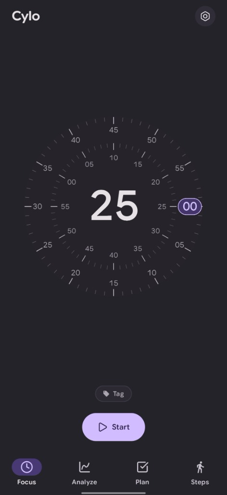
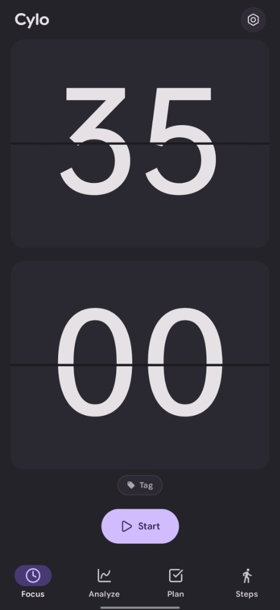
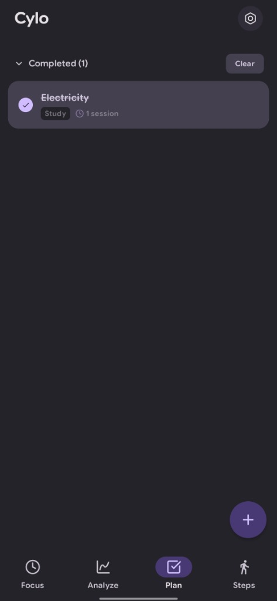
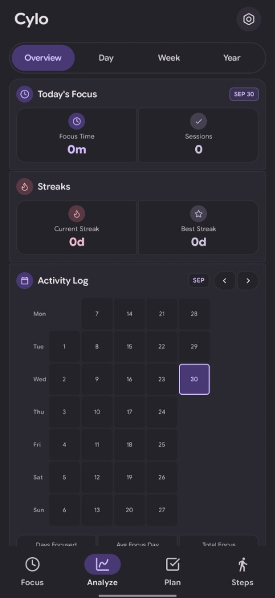

# Cylo — App Screenshots

> A focused companion app for Pomodoro timers, analytics, task planning, and sleep tracking.

---

## Focus Timer

Choose between expressive clock styles — such as **Concentric Dial** and **Flip Clock** — for an immersive, distraction-free session.

<table>
  <tr>
    <td align="center">
       
      <b>Concentric Dial Timer</b>
    </td>
    <td align="center">
       
      <b>Flip Clock Timer</b>
    </td>
  </tr>
</table>

---

## Planning & Analytics

Organize your tasks with session estimates and track streaks, stats, and activity with an interactive calendar heatmap.

<table>
  <tr>
    <td align="center">
       
      <b>Plan — Tasks & Sessions</b>
    </td>
    <td align="center">
       
      <b>Analyze — Overview & Activity Log</b>
    </td>
  </tr>
</table>
